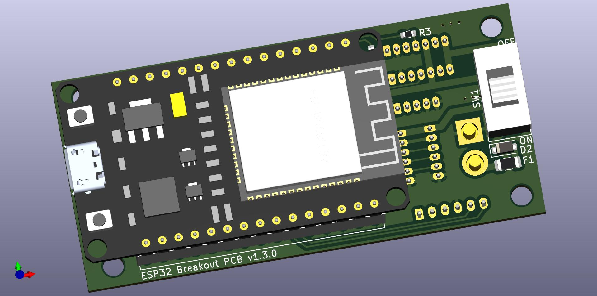
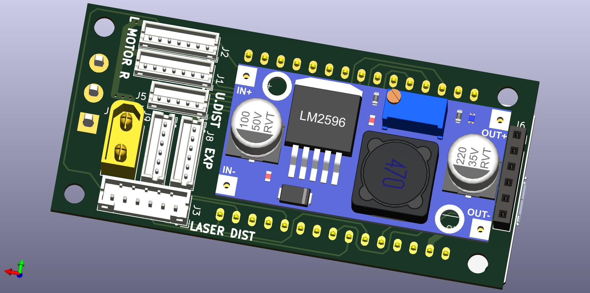

# Arduino ESP32 Breakout PCB for Maker's Pet robots

## Files
- [schematic PDF](output/esp32_breakout_schematic.pdf)
- [BoM .CSV](output/esp32_breakout_bom.csv), [BoM .XML](output/esp32_breakout_bom.xml)
- [Gerber .ZIP](output/esp32_breakout_gerber.zip)
- [3D model .STEP](output/esp32_breakout.step)
- KiCAD schematic, layout - in this folder

## Top

## Bottom

# Change log

## v1.3.0
- added quadrature encoder and brushed motor support
  - this includes the popular low-cost JGA25-370, N20 motors
- brushed motors require an additional driver module board
  - I recommend the L298N driver module due to its low cost, wide availability, 35V max voltage (i.e. exceeding 24V that we need). L298N handles 2A continuous and 3A peak (again, more than we need).
  - However, [L298N](https://www.st.com/resource/en/datasheet/l298.pdf) is not the most efficient driver module out there. You can increase its efficiency (i.e. your robot's battery life) by using motors with higher voltage, i.e. 24V.

## v1.2.1
- added support for 12V motors
  - 9V to 24V, max 1A peak per motor

## v1.2.0
- changed JST PH extension connectors to JST ZH
- changed JST PH 7-pin LDS connector to 6-pin
  - removed unused pin

## v1.1.0
- 3D-printed board enclosure to prevent accidental 24V shorts
- merged GPIO, US-100 sonar headers into a single 12-pin header

## v1.0.1
- fixed GPIO header footprint

## v1.0.0
- changed voltage regulator to LM2596 DC-DC module
  - unlike other low-cost DC-DC modules, LM2596 has built-in output current limit, short and thermal protection
  - LM2596 can accept up to 40V input as a measure for input overvoltage protection
  - Note that motors are not protected from overvoltage
- reduced the number of extension connectors to 2 from 3
  - for two Raspberry Pi Pico extension modules - one for the robot's head, one for the robot's body
- fixed extension interface I2C resistors
- replaced power connector with XT30 instead of Deans T-Plug
  - T-Plug requires uncomfortably too much insertion force
- added 24V input reverse polarity protection using a Schotki diode
- added 24 input overcurrent protection using a 2A one-time fuse
- removed support for LDS that don't control motor on/off
  - such LDS models are rare; this can be re-added later if needed
- added an ESP32 5V power supply protection Schottky diode
  - to prevent ESP32's USB back-charging the LM2596 voltage regulator
  - I don't believe this diode is necessary for LM2596 combined with built-in ESP32 Schottky diode, but let's have it just in case
- removed the 3-pin laser header and merged its GPIO to the GPIO connector
  - let's keep the ESP32 modules as a "platform" and put custom functionality on the Raspberry Pi Pico modules
  - customizing the ESP32 code to add custom functionality can easily slow down the ESP32 code that is optimized for speed and thus create issues
- changed the GPIO connector to single row from dual rows
  - to reduce the board size
  - I don't recommend using ESP32 GPIO because this requires modifying ESP32 code, which can easily slow down or break the ESP32 firmware.
    ESP32 is already pretty busy with ROS2 and WiFi low-latency communications.
  - please add custom functionality (sensors, servos, lights) to the Raspberry Pi Pico extension modules, not ESP32
- added US-100 ultrasonic range sensor
  - let's use US-100 instead of the popular HC-04 because HC-04 can "hang", sometimes requiring a power cycle.
    HC-04 performance varies depending on its manufacturer and some HC-04 modules are plain unusable.
    US-100 communicates with ESP32 using 9600 baud serial (less work for the ESP32 compared to HC-04)
    and offers a considerably better and consistent measurement quality. US-100 costs somewhat more compared to HC-04.
- fixed battery voltage sensing ADC resistor divider values
- removed battery charging connector
  - the charging connection depends on the battery BMS, therefore the charger/dock should connect to the battery instead of the board
- added silkscreens: makerspet.com, board name and version

## v0.1 PCB prototype
- Deans T-Plug type battery connector
- barrel-type battery charger connector
- US-100 ultrasonic distance sensor header
- laser pointer header
- miscellaneous unused GPIO header
- battery voltage sensing using ESP32 ADC
- PCB mounting holes
- 3 I2C extension connectors
- power-on switch
- LDS connector supporting a large variety of laser distance scanners, including those that don't control motor on/off
- fixed motors "kicking" during power-up
  - reassigned some motor control signals to ESP32 GPIO that do not toggle during ESP32 power-up boot
- mini560 Pro 5V DC-DC voltage regulator module
