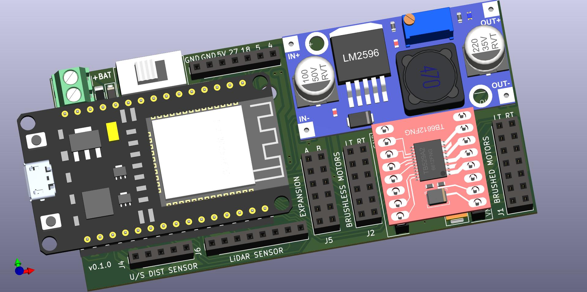
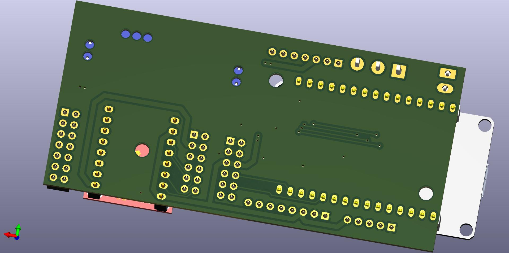

# Arduino ESP32 Combined PCB for Maker's Pet robots

## Files
- [schematic PDF](output/esp32_combined_schematic.pdf)
- [BoM .CSV](output/esp32_combined_bom.csv), [BoM .XML](output/esp32_combined_bom.xml)
- [Gerber .ZIP](output/esp32_combined_gerber.zip)
- [3D model .STEP](output/esp32_combined.step)
- KiCAD schematic, layout - in this folder

## Top

## Bottom

# Change log

## v1.3.0
- added quadrature encoder and brushed motor support
  - this includes the popular low-cost JGA25-370, N20 motors
- brushed motors require an additional driver module board
  - I recommend the L298N driver module due to its low cost, wide availability, 35V max voltage (i.e. exceeding 24V that we need). L298N handles 2A continuous and 3A peak (again, more than we need).
  - However, [L298N](https://www.st.com/resource/en/datasheet/l298.pdf) is not the most efficient driver module out there. You can increase its efficiency (i.e. your robot's battery life) by using motors with higher voltage, i.e. 24V.
- changed motor connectors from JST PH to JST ZH
- changed ultrasonic distance sensor connector from 2.54mm header to JST ZH

## v0.1.0
- combined designs into a single-board solution
  - [ESP32 Breakout board](../esp32_breakout/)
  - brushed motor driver TB6612FNG
  - LiDAR motor driver (for LiDARs that don't have it built-in)
- uses Dupont 2.54mm socket connectors
  - widely available and inexpensive
  - keyed to reduce wiring mistakes
- supports both brushed and brushless motors
  - 9..12V (13.5V max), 1.2A max (average) per motor
  - example: 12V JGA25-370 brushed motors with quadrature encoder and a gearbox
  - example: 12V N20 brushed motors with quadrature encoder and a gearbox
  - example: CHR-GM25-BLDC2418 i45 12V BLDC motor with built-in driver
- battery examples
  - 9x AA batteries in series
  - 3x 18650 Li-ion in series with built-in protection; enclosure required for safety; 5A max current should be sufficient
- LM2596 voltage regulator is now SMD mounted
  - for simpler assembly
- battery is now connected using a screw terminal block
  - to avoid having non-Dupont connectors