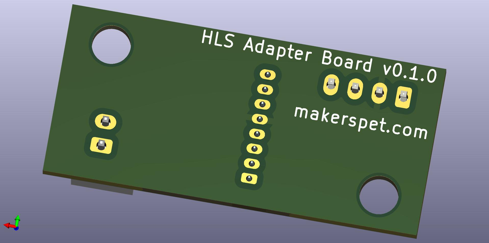

# Adapter PCB for HLS-LFCD2, HLS-LFCD3 LiDAR/LDS

Adapter PCB for HitachiG Data Storage LiDAR/LDS sensors:
- HLS-LFCD2
- HLS-LFCD3

This [Arduino LDS library](https://github.com/kaiaai/LDS) supports all these sensor models.

## Files
- [schematic PDF](output/hls_adapter_schematic.pdf)
- [BoM .CSV](output/hls_adapter_BoM.csv), [BoM .XML](output/hls_adapter_BoM.xml)
- [Gerber .ZIP](output/hls_adapter_gerber.zip)
- [3D model .STEP](output/hls_adapter_adapter.step)
- KiCAD schematic, layout - in this folder

## Top

## Bottom

# Change log

## v0.1.0
- initial prototype