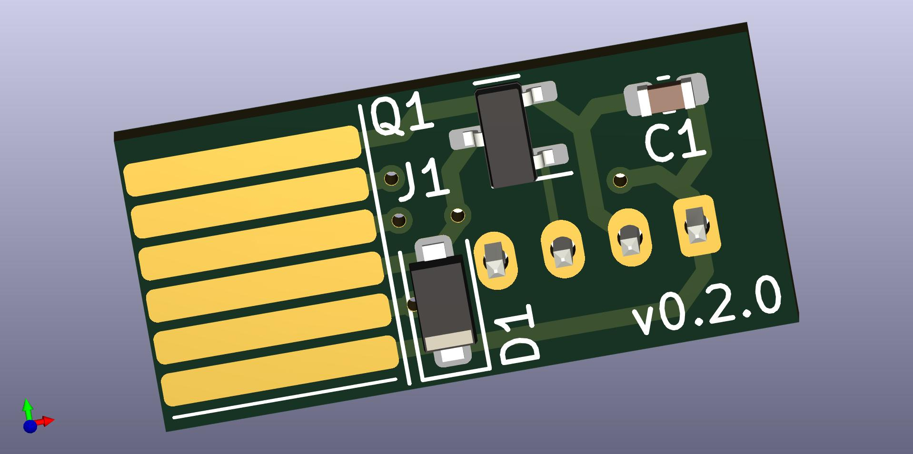
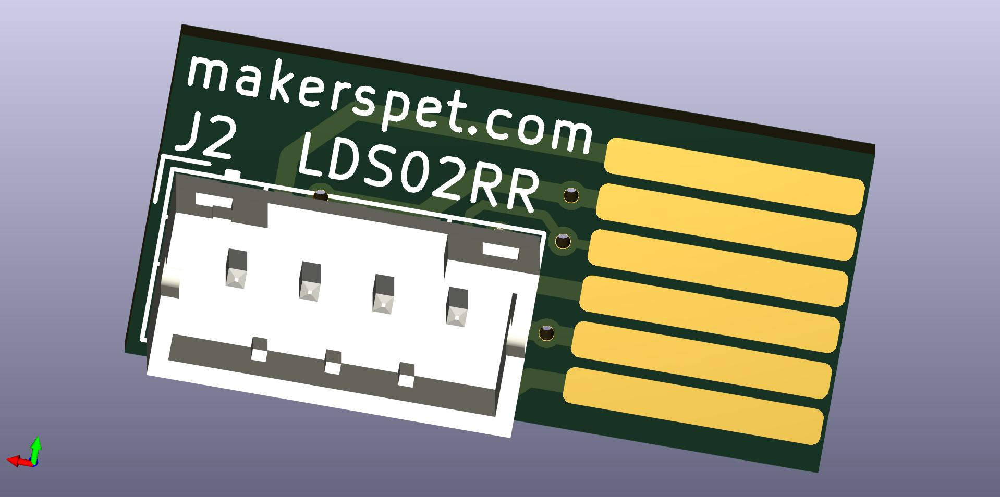

# Adapter PCB for LDS02RR laser distance scanner

Connect LDS02RR to Arduino to capture laser distance data.

This PCB implements PWM motor control for LDS02RR. Find
sample Arduino ESP32 firmware code [here](https://github.com/kaiaai/LDS02RR_ESP32).

## Files
- [schematic PDF](output/LDS02RR_adapter_schematic.pdf)
- [BoM .CSV](output/LDS02RR_adapter_BOM.csv), [BoM .XML](output/LDS02RR_adapter_BOM.xml)
- [Gerber .ZIP](output/LDS02RR_adapter_gerber.zip)
- [3D model .STEP](output/LDS02RR_adapter.step)
- KiCAD schematic, layout - in this folder

## Top

## Bottom

# Change log

## v0.1.0
- initial prototype
- PCB inserts into LDS02RR connector
- 4-pin JST PH connector - 5V, GND, LDS motor PWM, LDS TX
