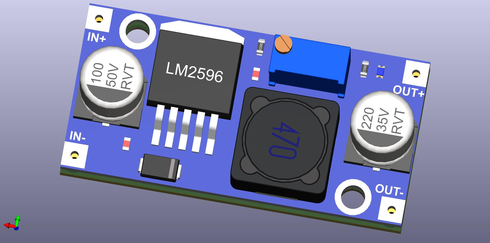

# Adapter PCB for LiDAR/LDS

A convenience adapter for LiDAR/LDS spinning sensors that already have built-in motor control. This adapter PCB breaks out the [ESP32 PCB](https://github.com/makerspet/pcb/tree/main/esp32_breakout) LDS connector into connectors for each sensor model to avoid making custom LiDAR/LDS cables.

Supported sensor models include:
- YDLIDAR X4
- Hitachi-LG HLS-LFCD2
- RPLIDAR A1.

This [Arduino LDS library](https://github.com/kaiaai/LDS) supports all these sensor models.

## Files
- [schematic PDF](output/lds_breakout_schematic.pdf)
- [BoM .CSV](output/lds_breakout_BoM.csv), [BoM .XML](output/lds_breakout_BoM.xml)
- [Gerber .ZIP](output/lds_breakout_gerber.zip)
- [3D model .STEP](output/lds_breakout_adapter.step)
- KiCAD schematic, layout - in this folder

## Top

## Bottom

# Change log

## v0.1.0
- initial prototype