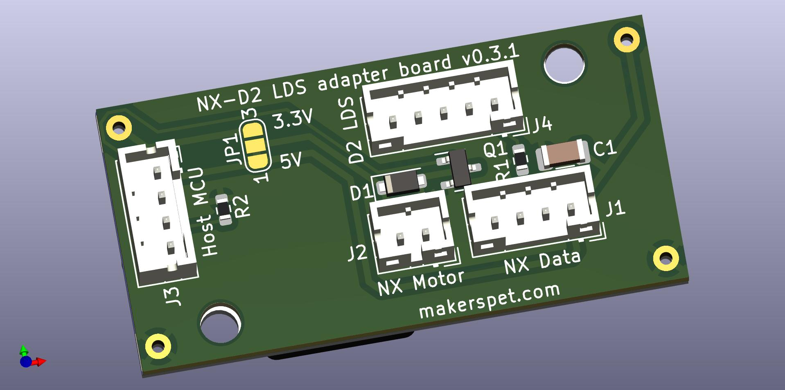

# Adapter PCB for Neato XV11, Delta2G laser distance scanner

Connect Neato XV-11/Botvac or 3irobotix Delta-2G LiDAR/LDS to Arduino to capture laser distance data.

This PCB interfaces the Arduino/ROS2 robot [ESP32 breakout PCB](https://github.com/makerspet/pcb/tree/main/esp32_breakout) to Neato XV11/Botvac and 3irobotix Delta-2G LDS sensors, including LDS PWM motor control.

This [Arduino LDS library](https://github.com/kaiaai/LDS) supports all these sensor models.

## Files
- [schematic PDF](output/neato_delta_adapter_schematic.pdf)
- [BoM .CSV](output/neato_delta_adapter_BoM.csv), [BoM .XML](output/neato_delta_adapter_BoM.xml)
- [Gerber .ZIP](output/neato_delta_adapter_gerber.zip)
- [3D model .STEP](output/neato_delta_adapter.step)
- KiCAD schematic, layout - in this folder

## Top

## Bottom

# Change log

## v0.3.0
- added Delta-2G connector

## v0.2.0
- added a bypass capacitor

## v0.1.0
- initial prototype
- optional LM2596 voltage regulator module provides 3.3V to motor